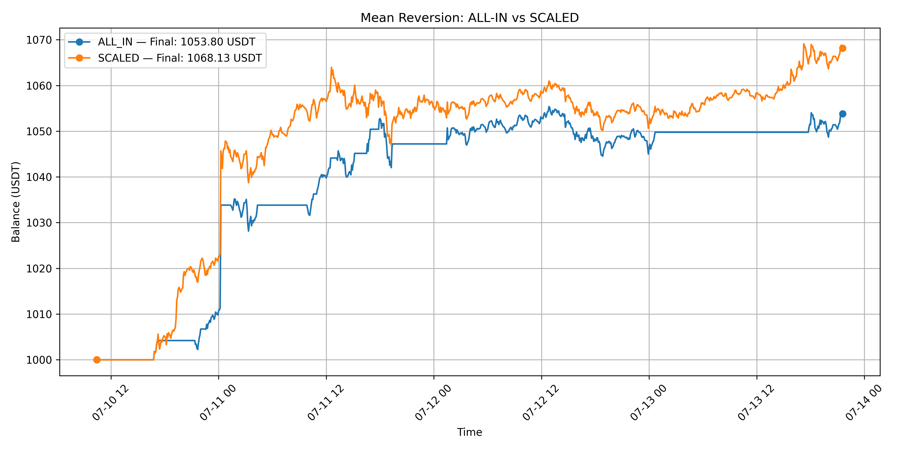
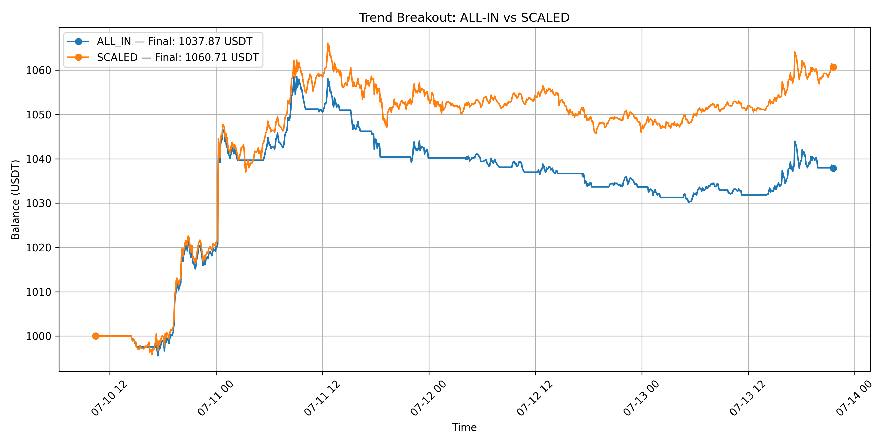
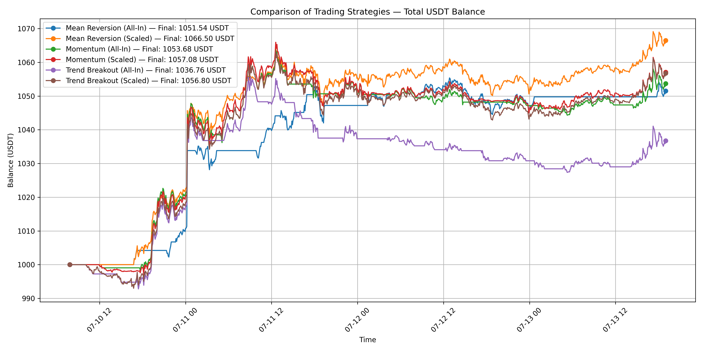
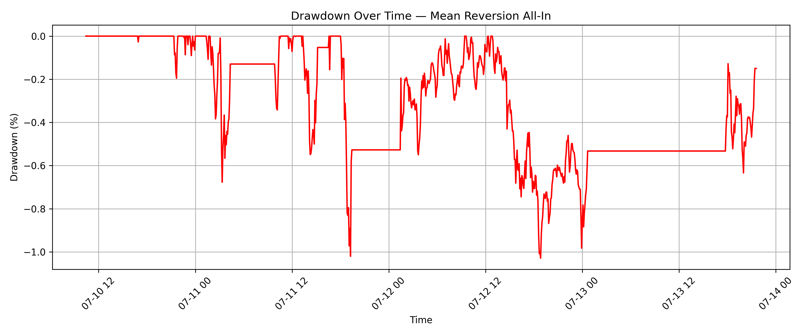
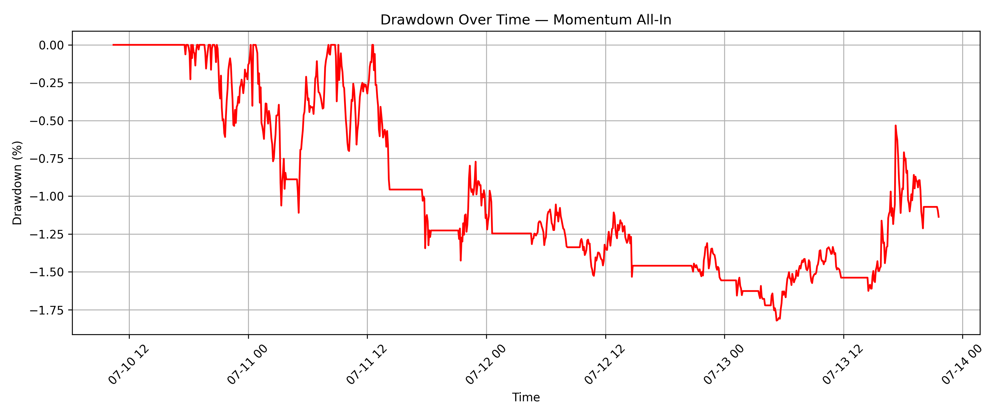
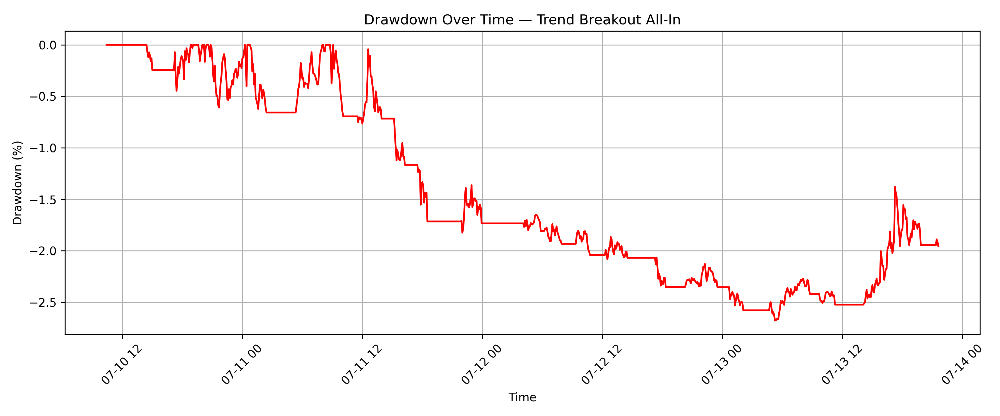

<h1 align="left">
  PyMetrics Analysis Engine
</h1>

## 📚 Table of Contents

- [🧠 Summary](#-summary)
- [⚙️ Tech Stack](#%EF%B8%8F-tech-stack)
- [📂 Project Structure](#%EF%B8%8F-project-structure)
- [🛠️ How to Run](#%EF%B8%8F-how-to-run)
- [🌐 API Integration & Robust Data Ingestion](#-api-integration--robust-data-ingestion)
- [🧭 Strategy Exploration & Justification](#-strategy-exploration--justification)
- [📉 Risk Control & Capital Allocation Modeling](#-risk-management--capital-protection)
- [🔄 Out-of-Sample Performance (Fresh Market Data)](#-out-of-sample-performance-fresh-market-data)
- [🧪 Core Engine Design (State Management)](#-core-engine-design-state-management)
- [📊 Metrics & Performance Interpretation](#-metrics--performance-interpretation)
- [📈 Strategy Performance Comparison: All-In vs Scaled](#-strategy-performance-comparison-all-in-vs-scaled)
- [📉 Drawdown Analysis & Risk Behavior](#-drawdown-analysis--risk-behavior)
- [🚀 Future Improvements & Robustness](#-future-improvements--robustness)
- [🐞 Key Problem-Solving Challenges](#-key-problem-solving-challenges)
- [🎯 Final Reflections](#-final-reflections)
- [📎 Project Info](#-project-info)

## 🧠 Summary

Hey there! So, I've basically cooked up a **Python backend engine** just for checking out time series data and testing out different algorithmic theories. The main thing wasn't chasing massive profits... I really wanted to build a **solid**, **reliable simulation playground**. This let me see how different **money management styles** (like going all-in versus scaling things back) affect the **stability** and **risk** of my code's signals. It's all about keeping the system safe, you know?

## ⚙️ Tech Stack

- **Language**: Python 3.10+
- **API Integration**: Robust data ingestion via `ccxt`. Includes **Error Handling** (`try...except`) for system stability and fault tolerance during network disruptions
- **Data Processing**: `pandas` for efficient time series manipulation and analytical calculations
- **Testing Core**: Custom-built backtesting engine responsible for **portfolio state management** and enforcing risk rules
- **Automation & CLI**: `argparse` facilitates **Command-Line Interface** control, enabling test automation and CI integration
- **Visualization**: Matplotlib is utilized for precise visual representations of comparative performance

## 🗂️ Project Structure

The project utilizes a modular architecture for separation of concerns and testability.

- `simulate.py` — **Main Execution Engine (CLI)**: Orchestrates pipeline, manages **portfolio state**, and logs results
- `visualize.py` — **Metrics Visualization Tool**: Generates comparative plots and drawdown analysis
- `core/` — **Core Backend Services**:
  - `data_fetcher.py` — Manages **API Integration**. Includes **robust error handling** for stability
  - `metrics.py` — Computes all key performance metrics (Max Drawdown, Growth %)
- `strategies/` — **Signal Logic Module**: Stores individual algorithmic hypothesis files
  - `mean_reversion.py` — Logic for mean reversion strategy
  - `momentum.py` — Logic for momentum strategy
  - `trend_breakout.py` — logic for trend breakout strategy
- `signals/` — Directory for generated strategy signals `.csv`
- `output/` — Directory for final simulation results and charts (`.csv` + `.png`)

## 🛠️ How to Run

To run the project, follow these steps:

```bash
# Make sure Python 3.10+ is installed and added to your PATH
# You can get it from https://www.python.org/downloads/

# Clone the repository
git clone https://github.com/RiazBhuiyanX/python-metrics-engine.git
cd python-metrics-engine

# Install dependencies (option 1 - recommended)
pip install -r requirements.txt

# Or install manually (option 2)
pip install pandas matplotlib ccxt
```

### Output structure:

- `signals/` → raw buy/sell signals per strategy (.csv)
- `output/` → simulation results & visual charts (.csv + .png)

### 🔁 Pre-Generated Results Available

This repo already includes:

- Precomputed strategy signals in `/signals/*.csv`
- Final simulation results in `/output/*.csv`
- Visual charts for strategy comparison and drawdown in `/output/*.png`

You do **not** need to re-run the scripts unless you want to test live data again.

### 🧪 Want to Run on Fresh Data?

You can re-run the full pipeline on new Binance data by doing:

```bash
# Runs ALL strategies in ALL modes (default)
python simulate.py

# Runs only the Momentum strategy in Scaled mode
python simulate.py --strategy momentum --mode scaled

# Runs only the Momentum strategy in All-In mode
python simulate.py --strategy momentum --mode all_in

# Runs only the Momentum strategy in both Scaled and All-In mode
python simulate.py --strategy momentum --mode all

# Generate strategy comparison charts
python visualize.py
```

## 🌐 API Integration & Robust Data Ingestion

The system's input relies on the successful integration and management of external data sources, handled by `core/data_fetcher.py`. This module is designed for **robust API communication**.

- **Source**: Real-time historical OHLCV data is fetched from the Binance **API** using the `ccxt` library.
- **Robustness**: The `fetch_binance_data` function includes Error Handling (`try...except`) to gracefully manage network errors and exceptions during the API call. This prevents service failure due to external network issues, which is crucial for reliable R&D services.
- **Timezone Handling**: Raw UTC timestamps are converted to localized `Europe/Sofia` time for consistent data analysis and logging.

## 🧭 Strategy Exploration & Justification

When I first approached the challenge, I didn’t think of myself as a "trader" in the traditional sense. But I realized that I _do_ trade — just in a different context. My family runs a small business, and we often buy trending products and sell them at a premium. We try to anticipate demand, buy low, and sell high.

That mindset helped me frame this task in familiar terms: instead of predicting markets, I looked for **patterns where people tend to overreact**, and where we can **systematically profit** from that behavior while limiting the downside.

---

### 🔍 Reviewing Popular Strategies

To design something that could reasonably perform in a volatile, fee-less, short-term setting, I first explored a wide range of well-known trading approaches:

#### ❌ Rejected Strategies

| Strategy                 | Why I Didn't Use It                                                                                                                                                                                          |
| ------------------------ | ------------------------------------------------------------------------------------------------------------------------------------------------------------------------------------------------------------ |
| **Scalping**             | Requires ultra-low-latency execution and constant monitoring. Even though we assume zero fees, scalping relies on capturing small price inefficiencies — not feasible with OHLCV data and a basic simulator. |
| **Market Making**        | Too complex to simulate fairly. Market-making requires bid/ask spread modeling and order book interaction, which is out of scope here.                                                                       |
| **Arbitrage**            | Relies on inter-exchange price differences and fast infrastructure. It’s not a signal-based strategy and impossible to replicate in a static backtest (unfortunately!).                                      |
| **Swing/Day Trading**    | Describes time horizon, not entry/exit logic. My focus was on **strategy logic**, not holding duration.                                                                                                      |
| **Pure Trend Following** | Too vulnerable to false breakouts in sideways markets, which dominate low timeframes. I needed strategies that adapt faster.                                                                                 |

I also briefly explored the idea of **Market Making** (providing liquidity on both the buy and sell sides) and **Arbitrage** (covering all outcomes like in sports betting).
I quickly realized these strategies couldn't be tested fairly in this setup — market making requires a full order book simulation, and arbitrage isn't possible without multiple exchanges or pricing discrepancies to exploit.

---

### ✅ Strategy 1: Mean Reversion (initial choice)

After narrowing it down, **Mean Reversion** was my natural starting point:

- On short timeframes (5m), crypto prices often fluctuate around a local equilibrium.
- With **no fees**, even small reversion moves (~0.2%) can be captured profitably.
- It mirrors the behavior of a reactive market-maker — buying when others panic sell, and selling into spikes.
- It's conservative, which aligned with my initial mindset: **protect capital first**, then grow it.

This was the first strategy I coded up, and it basically shaped how I built the simulator and metrics engine.

---

### ➕ Why I Added Momentum

I quickly realized that while mean reversion works great in sideways or “choppy” markets, it **fails during strong trends** — exactly when you _don’t_ want to be betting against the market.

So, I added a **Momentum strategy**, which is essentially the opposite approach:

- It enters **with the trend**, on the assumption that strong price moves tend to continue.
- It uses a simple short vs. long SMA crossover to gauge shifts in momentum.
- It’s straightforward, robust, and tends to do well during clear directional moves (like breakouts or sustained trends).

By comparing it with Mean Reversion, I could test **how well a strategy performs _in regime X_ vs _regime Y_**.

---

### ➕ Why I Added Trend Breakout

Momentum is good for catching a trend once it’s underway. But what if I want to catch **the breakout itself** right as it happens?

That’s where the **Trend Breakout** strategy comes in:

- It goes long if the price breaks above the highest high of the last _N_ candles.
- It goes short if the price drops below the lowest low of the last _N_ candles.
- This strategy is **directly reactive to price action**, rather than based on moving averages.

The goal here was to grab those **explosive moves** early, especially when volatility suddenly spikes.

It also set up a great three-way comparison for me:

- **Breakout** = reacts to high volatility surges
- **Momentum** = confirms and rides sustained trends
- **Mean Reversion** = exploits snap-backs to equilibrium

---

### 📈 Why I Chose BTC/USDT

I selected the BTC/USDT pair for multiple practical and strategic reasons:

- **Liquidity**: BTC/USDT is one of the most liquid trading pairs in crypto, which means price movements are less distorted by individual trades. This makes backtests more reliable.
- **Volatility**: Bitcoin naturally has a lot of movement on low timeframes — perfect for testing both breakout and mean-reversion strategies (there’s plenty of action).
- **Data Availability**: It’s easy to get clean, high-frequency historical data for BTC/USDT (thanks to Binance + `ccxt`), with minimal gaps or weird spikes to worry about.
- **Market Independence**: BTC isn’t tied to a single company or central bank decision. It’s a decentralized asset. That means I can test price-driven strategies without needing to account for earnings reports.
- **USDT Stability**: Using USDT as the quote currency keeps all my balances in stable dollar terms. Gains and losses are easy to interpret, and I’m not adding forex or inflation risk on top.

In short, BTC/USDT offered a big, active, and clean sandbox to experiment with strategy logic under realistic market conditions.

## 📉 Risk Management & Capital Protection

From day one, I approached this challenge not as a profit-maximization game, but as a **survival problem**. As the prompt wisely points out: if you lose 50% of your capital, you need a 100% gain just to recover. So I knew I had to include capital preservation into the strategy logic from the start.

### 🛑 Stop Logic: 80% Capital Threshold

I implemented a strict **hard stop-loss rule**: if total portfolio value drops below **800 USDT** (i.e. a 20% drawdown), that strategy stops trading immediately for the rest of the simulation.

- This mimics a real trader going “risk-off” after hitting a serious loss threshold.
- It also prevents those dreaded "death spirals," especially in All-In mode where one bad trade can cascade.

In practice, this rule acted like a simple but effective **kill switch** to protect against catastrophic losses in any single run.

### 🔀 Two Execution Modes: All-In vs Scaled

Each strategy was tested in two capital deployment styles:

| Mode       | Description                                                            | Pros                           | Cons                             |
| ---------- | ---------------------------------------------------------------------- | ------------------------------ | -------------------------------- |
| **All-In** | Full capital is used on every signal (buy or sell)                     | High return potential          | Very high drawdown risk          |
| **Scaled** | Gradual exposure: 95% of USDT used when buying, or only 5% of BTC sold | Lower volatility, smoother PnL | May underperform in strong moves |

#### 💡 Why 95% Buy / 5% Sell?

I didn’t pick those 95/5 percentages out of thin air — I chose them after observing how **BTC tends to climb gradually** over time. My reasoning was:

- **Buying with 95%** of available USDT gives strong exposure to upward moves without completely emptying the account. This takes advantage of BTC’s general uptrend while still keeping 5% cash on hand.
- **Selling only 5%** of holdings on a signal avoids full liquidation on a dip, preserving some upside if the reversal signal is false and the price shoots back up.
- It smooths out the ride: profits (or losses) accrue over multiple smaller steps rather than one all-or-nothing jump.
- Empirically, in my tests this 95/5 split led to **higher final balances and lower drawdowns** for most strategies.

Overall, the 95/5 approach hit a sweet spot for me: It’s enough exposure to catch big trends, but conservative enough to avoid completely cashing out at the worst possible time during choppy action.

#### ⚠️ Minimum USDT Threshold

In the Scaled mode, I also added a practical rule: **no new buy trades are executed if available USDT falls below 10**.

This prevents:

- Executing meaningless micro-trades that would skew the metrics
- Slowly bleeding the account with a bunch of near-zero trades
- Unrealistic scenarios where rounding errors start to affect outcomes

This threshold reflects a real-world constraint: Exchanges have minimum order sizes, and you generally don’t want to waste your last few dollars on a trade that won’t move the needle. Essentially, if my remaining cash is down to \$9, it’s time to stop buying and just ride out whatever positions are left.

### 🧠 Risk Philosophy

In live trading, _how_ you size your position and control risk often matters more than the exact signal. I wanted my simulator to reflect that philosophy. So I imposed some simple, strict rules and kept things deliberately vanilla:

- No leverage (everything is 1x only)
- No compounding position sizes
- No overtrading
- Simple, strict rules

This made the testing much easier to interpret and kept the focus on the **strategy behavior** itself, rather than on any complex mechanics or leverage-induced craziness.

## 🔄 Out-of-Sample Performance (Fresh Market Data)

After submission, I re-ran the strategies on freshly fetched data (same strategy logic, different time window). Here’s what I observed:

| Strategy       | Mode   | Profit % | Max Drawdown % |
| -------------- | ------ | -------- | -------------- |
| Mean Reversion | All-In | +0.34%   | -2.28%         |
| Mean Reversion | Scaled | +1.06%   | -2.67%         |
| Momentum       | All-In | +1.34%   | -1.27%         |
| Momentum       | Scaled | +1.03%   | -1.93%         |
| Breakout       | All-In | -0.66%   | -2.63%         |
| Breakout       | Scaled | +0.77%   | -2.52%         |

### 🧠 Interpretation

While returns were lower than the initial simulation, strategies continued to behave in line with expectations:

- **Scaled execution consistently outperformed All-In**, showing better drawdown control.
- **Momentum strategies held up well**, even in a different market slice.
- **Breakout (All-In)** was the only net-negative — reinforcing its volatility sensitivity.

This reinforces my belief that the logic is **robust**, even if not overfit for maximum gains.

## 🧪 Core Engine Design (State Management)

To test each strategy fairly, I built a simple but consistent backtesting engine that models portfolio state over time. The goal wasn’t to create an industrial-grade simulator, but to capture the **essential dynamics** of trade execution, capital allocation, and risk control.

### 🧩 Core Concepts

Here’s how the backtester works at a high level:

- **State Tracking**: At every candle, the simulator tracks:

  - USDT balance
  - BTC holdings
  - Total portfolio value (USDT + BTC value)
  - Current signal (1 = buy, -1 = sell, 0 = hold)
  - Whether the stop-loss condition has been triggered

- **Signal Execution**:

  - If `signal = 1` (Buy signal):

    - **All-In** mode: use all available USDT to buy BTC.
    - **Scaled** mode: use 95% of available USDT (if above the \$10 threshold) to buy BTC.

  - If `signal = -1` (Sell signal):

    - **All-In** mode: sell _all_ BTC holdings.
    - **Scaled** mode: sell 5% of the BTC holdings.

- **Stop Logic**:

  - If total portfolio value drops below 800 USDT, the stop condition triggers.
  - Once triggered, the system ignores all further buy/sell signals for that run (essentially, it goes to cash and sits out).

- **Final Metrics Recorded**:

  - Total growth % (overall return)
  - Max drawdown %
  - Number of buy/sell signals processed
  - Duration of the simulation (time from first to last candle)
  - Final balance (in USDT terms)

### 💾 Output Logging

Each simulation writes its full trade-by-trade timeline to a CSV file. Every row has the timestamp, price, signal, both balances, total portfolio value, and a flag if the stop-loss was hit.

Having this detailed log makes it easy to:

- Visualize how the strategy’s equity curve progresses over time
- Compare different strategies side by side, candle by candle
- Debug or audit the logic if something looks off (I can trace through trades to see what happened)

---

### ⚠️ Known Limitations

I intentionally made a few simplifications in the simulator for the sake of transparency:

- Trades are assumed to execute **instantaneously at the close price** of each 5m candle.
- No slippage or partial fills are modeled.
- No trading fees (per the challenge instructions).
- No network latency between signal generation and trade execution.

These choices keep the simulation **transparent and deterministic**, letting me focus on the strategy’s behavior without worrying about exchange microstructure noise or randomness. In other words, if something went wrong, I knew it was the strategy, not some hidden trading friction.

## 📊 Metrics & Performance Interpretation

Once each simulation completes, I compute several key performance metrics using the final portfolio history. These metrics help me evaluate how each strategy behaves — not just whether it made money, but how it handled risk and signal efficiency.

### 📈 What I Measure

| Metric                  | Description                                                                     |
| ----------------------- | ------------------------------------------------------------------------------- |
| **Growth %**            | Final total USDT balance relative to starting capital (percentage gain or loss) |
| **Max Drawdown %**      | Worst peak-to-trough drop in total balance during the simulation                |
| **Buy/Sell Signals**    | Total number of buy or sell signals                                             |
| **Simulation Duration** | Length of the test period (time from first candle to last candle)               |

These are calculated via the `metrics.py` module after each run.

### 📊 How I Interpret Results

In trading, the “best” strategy isn’t just the one with the **highest final balance**. You have to consider how it handled risk and whether its performance is consistent. For example:

- A high-return strategy that nearly blew up (huge drawdowns) might be too risky to actually trade in real life.
- A strategy with modest profit but low volatility might be more attractive if it’s stable and repeatable (sleep-at-night factor).
- In my tests, the Scaled versions often had **smoother equity curves** and **better capital preservation** than their All-In counterparts, especially in sideways or volatile conditions.

By comparing each strategy in All-In vs. Scaled mode, I got insight into **how position sizing affects robustness**. It was a way to isolate the impact of money management on the same signal logic.

### 🧪 Sample Insight

> **One example:** In my tests, Trend Breakout (All-In) hit a higher peak balance at one point, but also suffered the steepest drawdown. Its Scaled variant offered much more consistent performance — especially during choppy periods when many breakouts failed.

Seeing contrasts like that helped me reason about **when and why** you might choose one strategy or execution mode over another.

### 🧱 Realistic Constraints

Not every Buy/Sell signal actually resulted in a trade:

- If the portfolio had no USDT (in All-In mode), a Buy signal couldn’t execute (no cash to buy with).
- If BTC holdings were zero (in any mode), a Sell signal did nothing (nothing to sell).

These edge cases are common in real trading and mean the number of signals can be different from the number of executed trades.

Also, you’ll notice I did **not** compute fancy stats like:

- **Sharpe Ratio**
- **Win Rate**
- **CAGR** (annualized return)

Why? Because the simulation spans only about **3.5 days** (\~1000 five-minute candles). Metrics like Sharpe or an annualized return would be pretty much nonsense on such a short timeframe — they’d look impressive perhaps, but wouldn’t be statistically sound. I didn’t want to include stats that would **give a false sense of precision** or be outright misleading.

## 📈 Strategy Performance Comparison: All-In vs Scaled

Below I break down how each strategy performed in both All-In and Scaled modes. Plotting their equity curves side by side revealed a lot about the trade-offs in risk, return, and stability for each approach.

---

### 🔁 Mean Reversion



**Final Balance:**

- All-In: **1053.80 USDT**
- Scaled: **1068.13 USDT**

**Observations:**

- The Scaled version clearly outperformed the All-In version, both in total return and in how smooth the ride was.
- The All-In equity curve had big stair-step jumps followed by long flat periods — a sign that it would go “all in” and then have no free capital to act on new signals until it fully exited. In other words, it often sat on its hands once fully invested.
- Scaled mode, on the other hand, could take advantage of many more of the small pullbacks, since it never fully closed itself off. It maintained some exposure and reacted continuously.
- Drawdowns in Scaled mode were smaller and recovered faster than the All-In mode’s drawdowns.

**Conclusion:**
Mean Reversion works best when it can trade frequently and nimbly. Scaled mode gave it that flexibility, whereas All-In tended to lock up the capital and miss a bunch of opportunities once it was fully deployed.

---

### 📈 Momentum


**Final Balance:**

- All-In: **1052.63 USDT**
- Scaled: **1059.10 USDT**

**Observations:**

- Both modes tracked each other pretty closely for the first half of the run. Around mid-simulation, the Scaled version started to pull ahead in stability (smoother gains) while All-In hit a few bumps.
- The All-In mode saw sharper drawdowns due to whipsaws (false momentum shifts where it flipped direction at the worst time).
- Scaled mode proved more resilient — by staying partially in the market, it didn’t get whipsawed as badly and could smooth out the impact of false signals.

**Conclusion:**
Momentum signals can be **noisy** on short timeframes. A Scaled approach helps by softening the impact of head-fake moves, resulting in a more robust and steady equity curve.

---

### 💥 Trend Breakout



**Final Balance:**

- All-In: **1037.87 USDT**
- Scaled: **1060.71 USDT**

**Observations:**

- This strategy showed the most dramatic difference between All-In and Scaled modes.
- All-In mode was hurt badly by false breakouts — it would go fully long or short on a breakout signal, only to see the price reverse, leading to a big immediate drawdown (and then it had no flexibility to re-enter, having either hit the stop or being fully out).
- Scaled mode stayed much more nimble. By entering and exiting in pieces, it preserved capital during the head-fake breakouts and could still participate when a real breakout followed.
- The breakout logic is more volatile, and the Scaled approach acted like a buffer against that volatility.

**Conclusion:**
For breakout strategies, capital preservation is absolutely key. The Scaled mode massively reduced the damage from false signals and still managed to capture the later stages of true breakouts.

## 🏆 Full Strategy Showdown: All Variants Compared

I also plotted the equity curves of all six strategy/mode combinations on one chart for a birds-eye comparison:

- **Mean Reversion (All-In & Scaled)**
- **Momentum (All-In & Scaled)**
- **Trend Breakout (All-In & Scaled)**



This view helps answer one question:  
**Which strategy, in which mode, handled this specific 3.5-day market window the best?**

---

### 🥇 Top Performer

📈 **Mean Reversion (Scaled)** came out on top with the **highest final balance (1068.13 USDT)**, and it did so with the smoothest equity curve. It captured lots of small pullbacks and avoided major drawdowns throughout the run.

---

### 🥈 Strong Contenders

- **Trend Breakout (Scaled)** – Final balance **1060.71 USDT**. It was volatile at times, but managed to recover and finish strong by the end.
- **Momentum (Scaled)** – Final balance **1059.10 USDT**. It showed consistent growth, though it was slightly dinged by a couple of whipsaw trades.

Notably, all the **Scaled** modes outperformed their All-In counterparts — highlighting just how important capital management and position sizing were in this experiment.

---

### 🚨 Weaker Performers

- **Trend Breakout (All-In)** – This was the worst performer, ending at **1037.87 USDT**. It suffered multiple failed breakouts and, because it was all-or-nothing, it lacked the flexibility to recover once things went south.
- **Momentum (All-In)** and **Mean Reversion (All-In)** ended up in a similar range (\~1052–1053 USDT). They weren’t terrible, but both had rougher equity curves with deeper drawdowns and more flat periods due to being fully committed on trades (capital lock-in).

---

### 💡 Final Insight

This comparison really drives home a key idea:

> **The signal logic matters — but _how_ you size your positions and manage exposure matters just as much.**

The Scaled strategies delivered smoother PnL curves, recovered from losses faster, and were generally more adaptable when the price action got unpredictable.

### 📉 Why Mean Reversion Outperformed

Even though BTC was in a mild uptrend during the simulation period, **Mean Reversion (Scaled)** ended up delivering the best performance. I’ll admit I was a bit surprised by that at first — you’d think trend-following strategies would benefit the most from an upward-trending market.

However, a few factors explain this outcome:

- The “uptrend” wasn’t very clean or sustained; it was punctuated by frequent short-term pullbacks.
- Those conditions are ideal for **mean reversion**, which profits from temporary price deviations snapping back to the mean.
- On the 5-minute timeframe, a lot of the apparent breakouts were actually false starts that reversed quickly.
- The Scaled mean reversion strategy let the portfolio stay active and responsive through those wiggles without ever overcommitting the capital.
- Momentum and breakout strategies, on the other hand, got caught by more lag and whipsaws – by the time they acted, the moves often fizzled or reversed.

The takeaway here is that **direction alone isn’t enough**. The _structure_ of the market’s moves and its _volatility profile_ are just as important in determining what works.

### 📊 Summary Table

| Strategy       | Mode   | Final Balance | Notes                            |
| -------------- | ------ | ------------- | -------------------------------- |
| Mean Reversion | All-In | 1053.80       | Missed smaller entries, choppy   |
|                | Scaled | 1068.13       | Best performer, smooth growth    |
| Momentum       | All-In | 1052.63       | Sharp drawdowns on false trends  |
|                | Scaled | 1059.10       | More resilient to whipsaws       |
| Breakout       | All-In | 1037.87       | Exposed to failed breakouts      |
|                | Scaled | 1060.71       | Smoothed damage, captured trends |

### 🧠 A Note on Data Limitations

While these results give some cool insights into how each strategy behaved under my test conditions, I have to emphasize the **limited scope of the data**:

- The simulation covers only **about 3.5 days** of 5-minute candles (1000 data points).
- During that period, **BTC was in a mild uptrend**, which naturally favors long-biased strategies like momentum and breakout.
- If the market had been sideways or strongly bearish during those days, the relative performance between these strategies could be very different (mean reversion might shine more, or maybe everything would have struggled).

So my conclusions here are **conditional**, not universal truths. These tests validate that the strategy logic and execution mechanics work as intended _for this scenario_, but they don’t prove any kind of long-term “edge.”

Given more time and data, I would love to test the strategies across:

- Different volatility regimes (quiet vs. volatile markets)
- Bearish vs. bullish trending periods
- Longer historical windows (several weeks or even months)

This would allow for more statistically robust results and help distinguish between strategies that are **structurally sound** and those that are just **lucky over a short stretch**.

## 📉 Drawdown Analysis & Risk Behavior

Profit isn’t the only metric that matters — **drawdown** is crucial because it shows how much capital was at risk during the rough patches. Below are the **maximum drawdowns** (peak-to-trough loss) for each strategy/mode combo:

| Strategy       | Mode   | Max Drawdown % |
| -------------- | ------ | -------------- |
| Mean Reversion | All-In | -1.03%         |
|                | Scaled | -1.61%         |
| Momentum       | All-In | -1.82%         |
|                | Scaled | -1.97%         |
| Breakout       | All-In | -2.68%         |
|                | Scaled | -1.91%         |

---

### 🧠 Why Scaled ≠ Always Lower Drawdown

You might expect the **Scaled** versions to always have lower drawdown than their All-In counterparts — but that wasn’t always true in my tests. Here’s why:

#### 🔸 1. **Slower Execution Accumulation**

In Scaled mode, positions are built gradually. That means your exposure actually increases _after_ the initial signal, not all at once. If the price starts moving against the position during that accumulation phase, the losses can compound as you continue to add into a losing trade.

#### 🔸 2. **Prolonged Partial Holding**

Unlike All-In (which exits a position fully on a sell signal), Scaled mode only trims the position. This can **extend the time spent in drawdown** since you’re still partially in the trade while the market is going against you. In a volatile chop, you might sit in a drawdown longer with a scaled approach.

#### 🔸 3. **Short Duration Simulation**

With only \~3.5 days of data, **short-term volatility can skew things a lot**. One or two unlucky entries for the Scaled strategy (especially early on) might make its drawdown look worse, and there wasn’t a lot of time for it to recover. In a longer test, those instances might average out, but here they had an outsized impact.

---

### 📉 Visual Breakdown

Below are drawdown-over-time plots for each All-In strategy. These help illustrate how “painful” each path is for a trader.

#### 🔁 Mean Reversion (All-In)



#### ⚡ Momentum (All-In)



#### 💥 Trend Breakout (All-In)



As you can see, **Trend Breakout (All-In)** had the deepest and most prolonged drawdowns, which is consistent with it being the worst performer overall. **Mean Reversion** and **Momentum** (All-In) had shallower dips but they happened more frequently — a sign of their noisier signals and rapid reaction to market moves.

---

### 🔍 Final Insight

> **Risk isn’t just a number — it’s what you have to emotionally survive.**

On paper, a strategy with a -1.8% max drawdown looks “better” than one with -2.6%. But if that first strategy hits its -1.8% drawdown every other day and takes a while to recover, it could _feel_ far riskier than the one that rarely dips but just had one bad 2.6% day.

Drawdown curves help tell the _real story_ behind the PnL line. They give context to whether a strategy’s risk is one big event or lots of little paper cuts, which matters a lot psychologically.

## 🚀 Future Improvements & Robustness

While this implementation fulfilled the goal of exploring strategy behavior and risk in a simple setting, it’s operating under tight constraints: only \~3.5 days of historical data, no slippage, no latency, and several simplifying assumptions. If I had more time (and resources), here’s what I would expand or refine:

---

### 1. Broader & Longer Data Horizon

- The current simulation uses only **1000 candles of 5-minute data** (\~3.5 days). This is a very limited window.
- I would pull in **weeks or even months** of data and test the strategies across **different market regimes** (bullish trends, bearish selloffs, sideways chop, etc.).
- This would let me evaluate **statistical robustness** and check for **overfitting**. It would also show how stable each strategy is under different volatility conditions.

---

### 2. Smarter Risk Management Models

- Right now, the strategies use fixed percentage thresholds for everything (95% buy, 5% sell, 80% stop-loss).
- With more time, I’d implement more adaptive risk management, such as:

  - **Volatility-based position sizing** (e.g. standard deviation to scale trade sizes)
  - **Trailing stop losses** to lock in profits while letting winners run
  - **Dynamic exposure adjustment** – for example, reduce position size after a series of losses or if recent signals have been unreliable

- These changes would create more adaptable strategies that can self-correct or dial risk up/down as market conditions evolve.

---

### 3. Strategy Combination & Regime Detection

- Currently, each strategy operates independently in its own silo.
- With more time, I’d build a simple **regime classifier** (e.g. detect if we’re in a trend vs. range vs. high volatility spike) and then **dynamically allocate capital** to whichever strategy is best suited for that regime.
- This would mimic a more realistic portfolio approach that pivots based on market behavior — essentially using the right tool for the job at the right time.

---

### 4. Advanced Performance Metrics

- I deliberately skipped metrics like **Sharpe Ratio**, **CAGR**, **Win Rate**, and **Profit Factor** because with the short dataset we have, they wouldn’t be meaningful.
- With a larger dataset, I’d compute:
  - **Sharpe** for risk-adjusted return
  - **Win Rate** to see what percentage of signals/trades were profitable (quality of signals).
  - **CAGR** (annualized growth) to understand long-term growth potential if the strategy scale persisted.
  - **Max consecutive losses** to get a sense of worst-case losing streak (helps in setting expectations and risk limits).

---

### 5. Execution & Microstructure Modeling

- In the current simulator, execution is perfect and immediate at candle close price.
- A more realistic trading engine would include factors like:

  - **Slippage** – prices moving between signal and execution, especially in fast markets.
  - **Partial fills** – not getting your whole order filled at once.
  - **Latency** – a delay between the signal and when the order actually executes.
  - **Minimum order sizes** – enforcing that you can’t trade tiny amounts beyond exchange limits.

- Including these would let me see which strategies hold up in the real world of trading friction, as opposed to just in theory with ideal execution.

---

### 6. Better Visualization & Real-Time Monitoring

- I would improve the plotting and visualization by adding interactive features: the ability to zoom in, hover for exact values, toggle different strategy lines, etc.
- Ideally, I’d also set up a **real-time dashboard** (perhaps in Streamlit or Plotly Dash) to watch the strategies play out live in a simulation. This would be super helpful for debugging and understanding behavior as it happens, not just after the fact.

---

### 7. Walk-Forward Testing & Cross-Validation

- The current approach tests each strategy on one contiguous block of data (one and done).
- I would implement more rigorous validation techniques:

  - **Walk-forward testing** – simulate deploying the strategy in a moving window, periodically updating any parameters with expanding or rolling data. This is like rolling the clock forward and seeing how the strategy adapts.
  - **Rolling-window re-evaluation** – similar idea, test on a window, move it, test again, to see consistency.
  - Even **cross-validation-style splits** over time (e.g. use week 1 to tune, week 2 to test, then week 2 to tune, week 3 to test, etc.) for parameter robustness (like how sensitive are results to the specific SMA periods chosen, for example).

- These techniques help ensure that any strategy “edge” isn’t just luck on one set of data.

---

### 8. Dependency Integration (C++/Go) and Performance

- I would identify performance-critical components (e.g., metrics calculation, complex signal generation) and rewrite them using **C++ or Go**.
- This would significantly improve runtime efficiency, directly addressing performance scaling for larger datasets.

---

### 9. CI/CD Parameterization

- I would externalize all strategy parameters (windows, thresholds, and stop-loss ratios) into a configuration file (e.g., YAML/JSON) to enable easy **CI/CD** integration and automated testing.

---

### 10. Logging and Monitoring

- I would implement a structured **logging system** (e.g., using Python's logging `module`) instead of simple `print()` statements.
- This is crucial for easier **debugging in production/service environments**.

---

### 📦 Final Thought

This challenge helped me focus on **clarity over complexity**, and to prioritize **capital preservation, interpretability, and reactivity**. With more time, I’d go deeper in market modeling — but even in this limited context, I believe the design choices demonstrate a deliberate and structured approach to trading system design.

## 🐞 Key Problem-Solving Challenges

Building this project wasn’t a straight line — it took a lot of trial, error, and iteration. Below are some real issues I ran into and how I resolved them along the way:

### 1. CLI Integration for Automation (Fixed)

The initial engine was hard-coded. I refactored `simulate.py` to be controlled via **command-line arguments** (`argparse`), allowing targeted execution of strategies and modes. This was crucial to prepare the engine for **automated testing in CI/CD environments**.

---

### 2. API Reliability & Error Handling (Fixed)

The initial design did not account for network failures. **FIX:** I implemented robust **Error Handling** (`try...except`) in the data fetching module to gracefully handle external API communication errors, ensuring the system remains stable under network uncertainty.

---

### 3. Timeframe Confusion & Too-Short Testing Windows

In my first attempt, I started with **1-minute candles** and a simple mean reversion strategy (using a ±0.5% threshold) in All-In mode. That gave me only about **3 hours of market data** to play with, which in hindsight was almost useless. The results were super noisy and unstable — too few trades, happening too fast, and basically no meaningful insights.

After some thought (and a few facepalms), I switched to **5-minute candles with 1000 bars (\~3.5 days)**. This offered a much better balance: it smoothed out some noise compared to 1-minute data but still provided enough trades and action to be informative.

---

### 4. Parameter Tuning by Observation, Not Overfitting

My initial ±0.5% price threshold (for mean reversion entries) was way too wide on short-term data — the strategy barely traded at all. It was basically asleep at the wheel. 😅 Through experimentation, I found that a **0.2% threshold** worked much better for capturing micro-deviations on the 5-minute timeframe.

I also realized I didn’t need to look back 20 candles at 1m resolution as I originally planned. Using **10 candles of 5m** data gave a similar look-back window (50 minutes of data) with far less noise and computation. This was a nice simplification that kept things efficient without losing insight.

---

### 5. Designing the Scaled Execution Mode

Initially, I only coded an All-In execution model. It didn’t take long to see that this was too binary and rigid — once the strategy went all-in, it couldn’t respond to any new signals until it fully exited, which meant a lot of missed opportunities and inflexibility.

That realization led me to implement the **Scaled mode** (95% buy / 5% sell). However, introducing this mode created new edge cases — for example, what to do when the USDT balance fell under \$10. I had to explicitly prevent those tiny micro-trades that would distort results (and realistically wouldn’t be worth it). This part was a bit of a headache to get right, but it made the simulation much more realistic.

---

### 6. Rounding Bug That Broke Trade Logic

At one point, I discovered I was rounding the portfolio values **before** checking the trade conditions. This led to some weird logic errors where a trade was skipped even though, in reality, there was enough capital to execute it.

This bug had me scratching my head for a while. I eventually realized I was essentially throwing away real available funds due to premature rounding. Once I fixed it (by handling exact comparisons in raw values and rounding only for reporting), trade execution became accurate and consistent with the signals.

---

### 7. Overoptimistic Metrics Early On

In early versions, I was calculating metrics like CAGR and Sharpe as if the simulation was running over **a full year** — which made every strategy look amazingly good on paper 😅. For example, a 3% gain over 3 days was being projected as thousands of percent annualized. Clearly, that was misleading because our test window was just 3.5 days.

I corrected the metrics logic to reflect only the **actual simulation duration**. This made the reported results much more realistic and honest. The strategies suddenly looked a lot less spectacular, but at least it wasn’t fantasy-land anymore.

---

### ✅ Final Thoughts

None of these were giant, showstopper bugs by themselves — but together they definitely shaped the final quality and credibility of the project. I treated each issue not just as something to fix, but as a chance to learn and to make the framework more robust and realistic.

In the end, what you see here is the result of **dozens of small course corrections** — and honestly, that iterative process was the most valuable part of the whole project for me.

## 🎯 Final Reflections

Coming into this challenge, I had never built or traded a real algorithmic strategy before. My only frame of reference was how we run our physical store — where we try to buy trending items early and sell them at a premium. That down-to-earth experience turned out to be surprisingly relevant: it got me to approach the market intuitively, thinking in terms of **finding patterns, managing inventory (capital), and surviving volatility**.

---

I didn’t try to “beat the market” with a mess of fancy indicators or aggressive curve-fitting. Instead, I focused on:

- Building clear, interpretable strategies
- Managing risk carefully at each step
- Making honest, reasonable assumptions
- And learning from every failed test or bad trade

Along the way, I encountered bugs, bad metrics, unrealistic assumptions, and edge cases I hadn’t planned for — and each of those taught me something and made the final result better.

---

More than anything, this project gave me a deeper appreciation for how **fragile trading strategies can be**, and how much value there is in keeping things simple, clear, and robust.

Whether or not my code is perfect, I’m proud of how I approached the problem: like a real-world trader would — with curiosity, discipline, and a healthy respect for uncertainty.

## 📎 Project Info

### 📄 License

This project is provided for educational purposes only under the MIT License.

### ⚠️ Disclaimer

This project is a simulation intended for academic and evaluation purposes only.  
It does not constitute financial advice or a recommendation to trade.  
Past performance is not indicative of future results.

### 👤 Author

**Name:** Riaz Bhuiyan  
**GitHub:** [@RiazBhuiyanX](https://github.com/RiazBhuiyanX)
